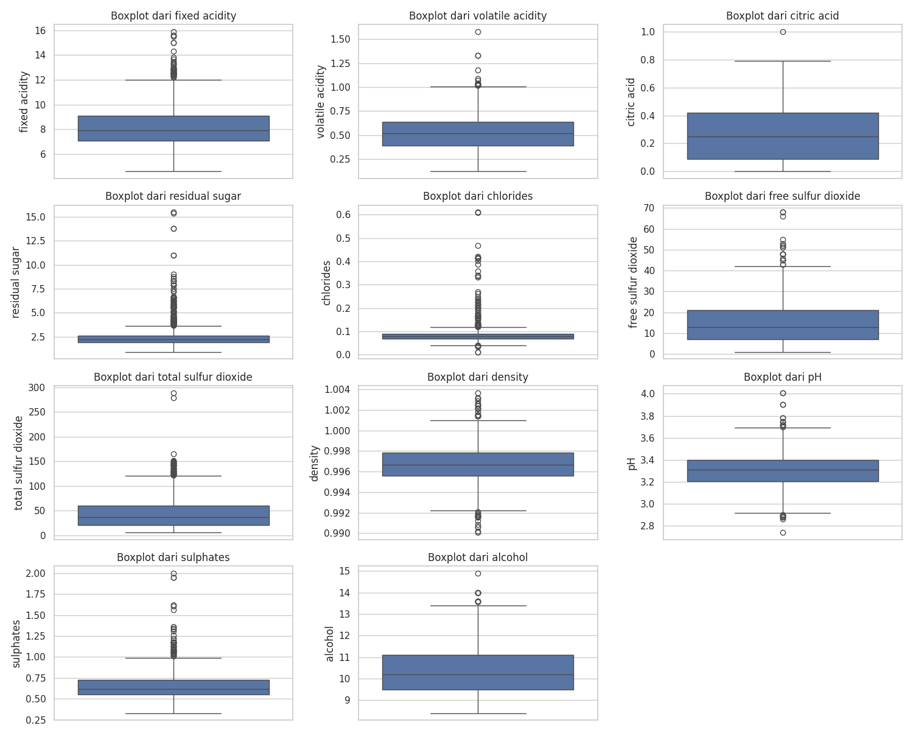
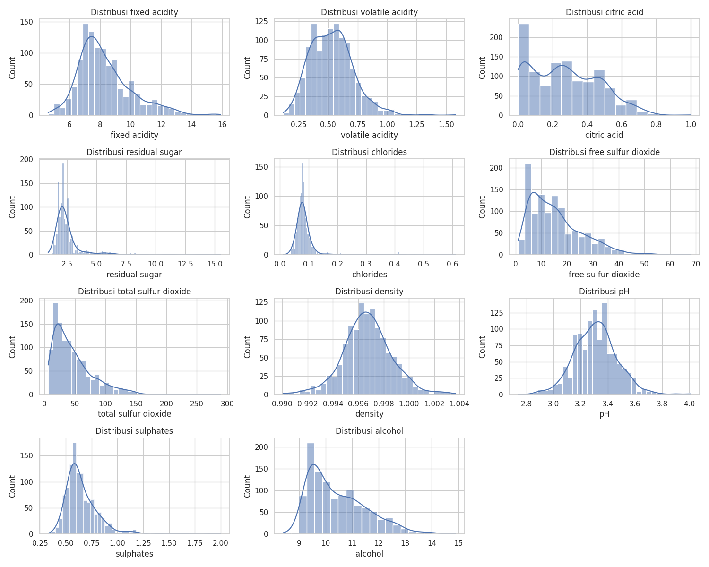
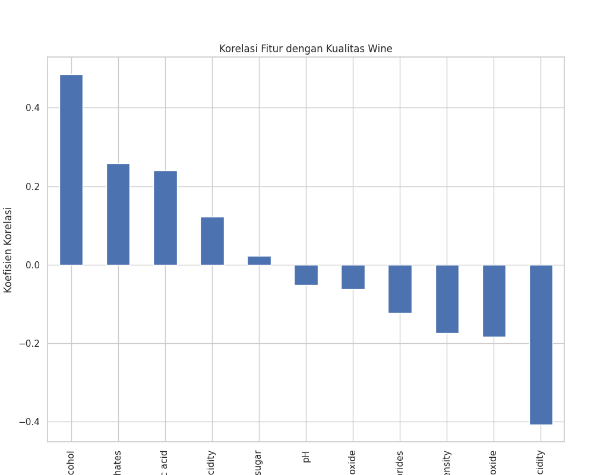
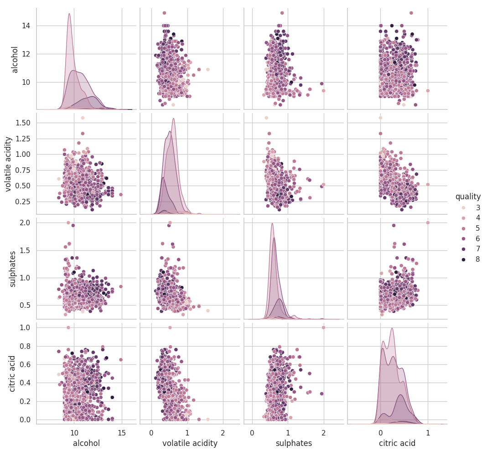
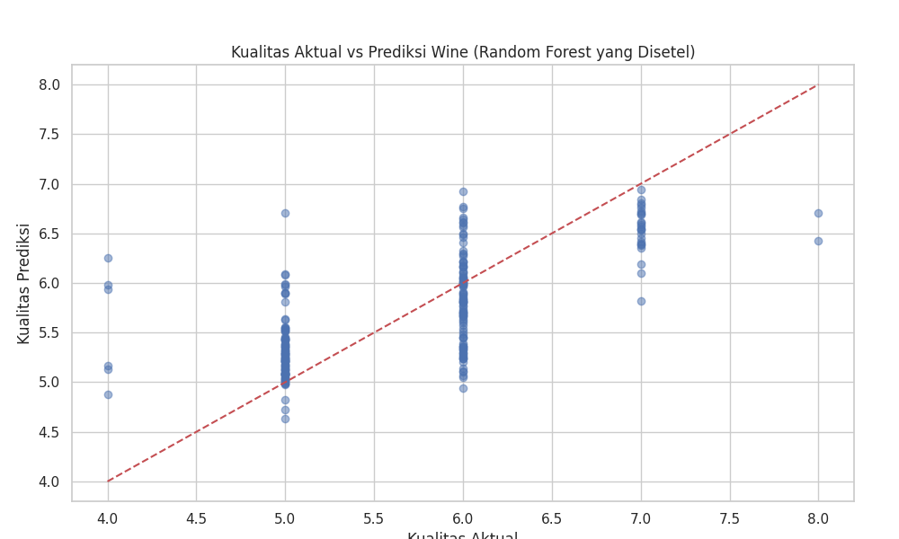
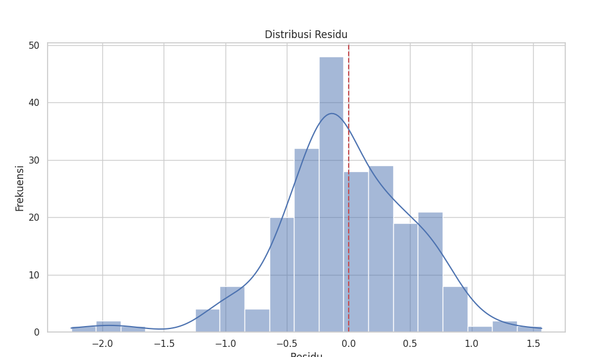
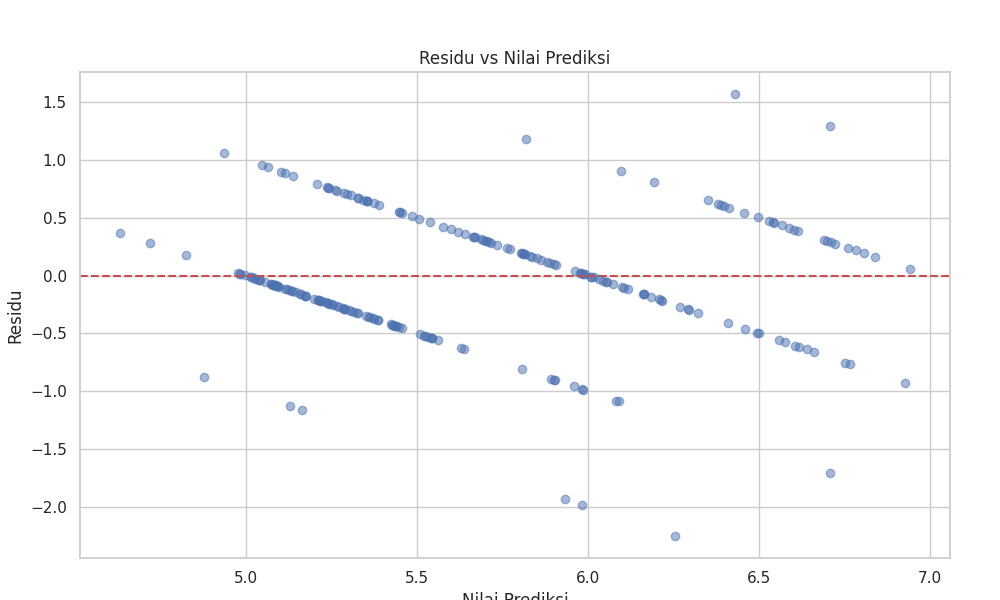

# Laporan Proyek Machine Learning - Zidan Mubarak

## Domain Proyek

Industri wine merupakan salah satu industri minuman tertua di dunia dengan nilai pasar global yang mencapai USD 417.85 miliar pada tahun 2023, dan diperkirakan akan terus tumbuh dengan CAGR sebesar 5.11% hingga 2028 [1]. Dalam industri ini, kualitas wine menjadi faktor krusial yang menentukan harga, reputasi produsen, dan kepuasan konsumen. Namun, proses penentuan kualitas wine secara tradisional dilakukan melalui uji sensorik yang dilakukan oleh para ahli atau sommelier, yang memiliki beberapa keterbatasan:

1. **Subjektivitas**: Penilaian kualitas sangat bergantung pada preferensi pribadi dan pengalaman penguji.
2. **Biaya tinggi**: Mempekerjakan sommelier profesional membutuhkan biaya yang signifikan.
3. **Tidak skalabel**: Proses manual ini tidak efisien untuk produksi dalam jumlah besar.
4. **Konsistensi**: Penilaian manusia dapat bervariasi karena berbagai faktor seperti kondisi fisik, waktu, dan lingkungan.

Permasalahan ini perlu diselesaikan karena dalam era industri modern yang kompetitif, produsen wine membutuhkan metode yang lebih objektif, konsisten, dan efisien untuk menilai dan memprediksi kualitas produk mereka. Dengan adanya kemajuan dalam bidang machine learning dan data science, kini dimungkinkan untuk mengembangkan model prediktif yang dapat memperkirakan kualitas wine berdasarkan karakteristik fisikokimia yang dapat diukur secara objektif.

Beberapa penelitian terdahulu telah menunjukkan efektivitas pendekatan ini. Cortez et al. [2] melakukan penelitian pionir menggunakan metode data mining untuk memprediksi kualitas wine berdasarkan atribut fisikokimia, dengan hasil yang menjanjikan. Lebih lanjut, Gupta [3] menggunakan berbagai algoritma machine learning seperti Random Forest dan Support Vector Machines untuk memprediksi kualitas wine, mencapai akurasi hingga 89%.

Pendekatan predictive analytics untuk menilai kualitas wine memberikan beberapa keuntungan signifikan, antara lain:

1. **Objektivitas**: Penilaian berbasis data yang konsisten dan terukur.
2. **Efisiensi biaya**: Mengurangi ketergantungan pada ahli wine yang mahal.
3. **Skalabilitas**: Mampu mengevaluasi jumlah sampel yang besar dengan cepat.
4. **Optimasi produksi**: Produsen dapat mengidentifikasi parameter fisikokimia yang paling berpengaruh terhadap kualitas wine dan mengoptimalkan proses produksi.
5. **Kontrol kualitas**: Memungkinkan deteksi dini dari batch wine yang tidak memenuhi standar kualitas.

Proyek ini akan mengembangkan model machine learning untuk memprediksi kualitas wine berdasarkan atribut fisikokimianya, dengan tujuan memberikan alat bantu yang objektif dan efisien bagi produsen wine dalam meningkatkan kontrol kualitas dan optimasi proses produksi.

**Referensi:**
1. Statista Research Department. (2023). "Wine - Worldwide | Statista Market Forecast." Statista. [Online]. Available: https://www.statista.com/outlook/cmo/alcoholic-drinks/wine/worldwide
2. P. Cortez, A. Cerdeira, F. Almeida, T. Matos, and J. Reis. (2009). "Modeling wine preferences by data mining from physicochemical properties." Decision Support Systems, vol. 47(4), pp. 547-553.
3. Y. Gupta. (2018). "Selection of important features and predicting wine quality using machine learning techniques." Procedia Computer Science, vol. 125, pp. 305-312.

## Business Understanding

### Problem Statements

Berdasarkan latar belakang yang telah diuraikan, berikut adalah beberapa permasalahan yang akan diselesaikan dalam proyek ini:

1. Bagaimana cara memprediksi kualitas wine secara objektif berdasarkan karakteristik fisikokimianya tanpa harus bergantung pada uji sensorik yang subjektif?
2. Atribut fisikokimia apa yang memiliki pengaruh paling signifikan terhadap kualitas wine?
3. Bagaimana mengembangkan model prediksi yang dapat digunakan oleh produsen wine untuk mengoptimalkan proses produksi dan meningkatkan kontrol kualitas?

### Goals

Tujuan dari proyek ini adalah:

1. Mengembangkan model machine learning yang dapat memprediksi kualitas wine berdasarkan karakteristik fisikokimianya dengan tingkat akurasi yang baik (ditargetkan RMSE < 0.5 untuk model regresi).
2. Mengidentifikasi dan menganalisis atribut fisikokimia yang memiliki pengaruh paling signifikan terhadap kualitas wine untuk memberikan wawasan yang berharga bagi produsen.
3. Membangun model prediktif yang dapat diimplementasikan oleh produsen wine untuk mengoptimalkan parameter produksi dan meningkatkan kontrol kualitas secara keseluruhan.

### Solution Statements

Untuk mencapai tujuan-tujuan di atas, berikut adalah solusi yang diusulkan:

1. **Solusi 1: Model Regresi Linear**
   - Mengembangkan model regresi linear sebagai baseline untuk memprediksi kualitas wine.
   - Kelebihan dari pendekatan ini adalah interpretabilitas hasil yang tinggi, di mana koefisien model dapat langsung menunjukkan pengaruh masing-masing atribut fisikokimia terhadap kualitas wine.
   - Performa model akan diukur dengan metrik RMSE (Root Mean Squared Error), MAE (Mean Absolute Error), dan R² (Coefficient of Determination).

2. **Solusi 2: Model Random Forest**
   - Mengembangkan model Random Forest untuk memprediksi kualitas wine dengan lebih akurat.
   - Random Forest dipilih karena kemampuannya menangani hubungan non-linear antara fitur dan target, serta ketahanannya terhadap overfitting.
   - Model ini juga dapat memberikan informasi tentang feature importance, yang akan sangat berguna untuk mengidentifikasi atribut fisikokimia yang paling berpengaruh.
   - Performa model akan diukur dengan metrik yang sama seperti regresi linear, namun diharapkan memberikan hasil yang lebih baik.

3. **Solusi 3: Model Gradient Boosting**
   - Mengembangkan model Gradient Boosting untuk meningkatkan akurasi prediksi.
   - Gradient Boosting dikenal dapat menghasilkan performa yang lebih baik dibandingkan model-model konvensional, terutama pada dataset dengan jumlah sampel yang cukup.
   - Model ini juga menyediakan informasi feature importance.
   - Performa akan diukur dengan metrik yang sama seperti model-model sebelumnya.

Selain itu, akan dilakukan hyperparameter tuning pada model terbaik untuk mengoptimalkan performa prediksi. Hyperparameter tuning ini akan menggunakan metode Grid Search dengan cross-validation untuk menemukan parameter optimal yang memaksimalkan performa model.

## Data Understanding

Data yang digunakan dalam proyek ini adalah dataset Wine Quality yang berisi informasi tentang berbagai atribut fisikokimia wine beserta penilaian kualitasnya. Dataset ini berisi 1.143 sampel wine dengan 11 fitur fisikokimia dan 1 variabel target (quality). Dataset dapat diakses melalui [Dataset Kaggle](https://www.kaggle.com/datasets/yasserh/wine-quality-dataset).

### Variabel-variabel pada Wine Quality Dataset

Dataset ini terdiri dari beberapa variabel yang menggambarkan karakteristik fisikokimia dari wine, serta variabel target yang merepresentasikan kualitas wine. Berikut adalah penjelasan untuk masing-masing variabel:

| Variabel | Deskripsi | Satuan |
|----------|-----------|--------|
| **fixed acidity** | Keasaman tetap dalam wine, terutama terkait dengan kandungan asam tartarat, asam malat, dan asam sitrat | g/dm³ |
| **volatile acidity** | Keasaman yang mudah menguap, terutama terkait dengan kandungan asam asetat. Kadar yang terlalu tinggi dapat menyebabkan rasa asam yang tidak diinginkan | g/dm³ |
| **citric acid** | Kandungan asam sitrat dalam wine. Dapat menambah 'kesegaran' dan kompleksitas rasa pada wine | g/dm³ |
| **residual sugar** | Jumlah gula yang tersisa setelah proses fermentasi. Mempengaruhi tingkat kemanisan wine | g/dm³ |
| **chlorides** | Kandungan garam dalam wine, terutama natrium klorida. Dapat mempengaruhi rasa asin | g/dm³ |
| **free sulfur dioxide** | Kandungan sulfur dioksida bebas, yang berfungsi sebagai pengawet dan antimikroba | mg/dm³ |
| **total sulfur dioxide** | Total kandungan sulfur dioksida (bebas dan terikat). Kadar yang terlalu tinggi dapat menyebabkan aroma dan rasa yang tidak diinginkan | mg/dm³ |
| **density** | Densitas atau kerapatan wine, umumnya berhubungan dengan kandungan alkohol dan gula | g/cm³ |
| **pH** | Tingkat keasaman wine, nilai yang rendah menunjukkan wine lebih asam | Skala 0-14 |
| **sulphates** | Kandungan sulfat yang ditambahkan, yang berkontribusi pada sulfur dioksida dan berfungsi sebagai pengawet | g/dm³ |
| **alcohol** | Persentase kandungan alkohol dalam wine | % vol |
| **quality** | Variabel target yang menunjukkan kualitas wine, dinilai oleh setidaknya 3 ahli wine dengan skala dari sangat buruk hingga sangat baik | Skala 0-10 |

### Eksplorasi Data

Untuk memahami data dengan lebih baik, berikut adalah beberapa analisis eksplorasi yang dilakukan:

#### 1. Statistik Deskriptif dan Visualisasi Distribusi

Berikut adalah visualisasi distribusi data melalui boxplot yang menunjukkan ringkasan statistik dari dataset Wine Quality:



Dari visualisasi boxplot di atas, kita dapat melihat beberapa hal penting:
- Rentang nilai kualitas wine berkisar antara 3 hingga 8, dengan mayoritas sampel berada pada kualitas 5-6.
- Terdapat variasi yang cukup besar pada beberapa fitur seperti residual sugar, free sulfur dioxide, dan total sulfur dioxide.
- Konsentrasi alkohol bervariasi dari sekitar 8.4% hingga 14.9%, dengan median sekitar 10.4%.
- Beberapa fitur seperti residual sugar, chlorides, dan sulphates memiliki outlier yang signifikan, yang dapat mempengaruhi model.
- Fixed acidity menunjukkan distribusi yang cukup lebar dengan beberapa outlier di bagian atas.

#### 2. Distribusi Variabel Target


Distribusi variabel target menunjukkan bahwa:
- Sebagian besar sampel memiliki kualitas 5-6, menunjukkan wine berkualitas menengah.
- Terdapat sangat sedikit sampel dengan kualitas ekstrim (3, 4, 8, 9), yang dapat menyulitkan model untuk memprediksi kualitas pada range tersebut.
- Distribusi tidak seimbang (imbalanced), yang perlu dipertimbangkan dalam pemodelan.

#### 3. Distribusi Fitur



Dari visualisasi distribusi fitur, dapat diobservasi bahwa:
- Beberapa fitur seperti residual sugar dan chlorides memiliki distribusi yang miring ke kanan (positively skewed).
- Fitur seperti pH dan fixed acidity memiliki distribusi yang lebih mendekati normal.
- Terdapat beberapa outlier pada fitur-fitur tertentu yang perlu ditangani.

#### 4. Korelasi antar Fitur


Analisis korelasi menunjukkan bahwa:
- Terdapat korelasi positif yang kuat antara fixed acidity dan density (0.68).
- Terdapat korelasi negatif yang kuat antara density dan alcohol (-0.49).
- Alcohol memiliki korelasi positif yang paling kuat dengan quality (0.48), menunjukkan bahwa wine dengan kandungan alkohol yang lebih tinggi cenderung memiliki kualitas yang lebih baik.
- Volatile acidity memiliki korelasi negatif yang signifikan dengan quality (-0.41), menunjukkan bahwa kadar asam asetat yang tinggi cenderung menurunkan kualitas wine.

#### 5. Korelasi dengan Variabel Target



Dari analisis korelasi dengan variabel target, kita dapat melihat bahwa:
- Alcohol memiliki korelasi positif tertinggi dengan quality (0.48).
- Volatile acidity memiliki korelasi negatif tertinggi dengan quality (-0.41).
- Fitur-fitur lain seperti sulphates (0.26), citric acid (0.24), dan total sulfur dioxide (-0.18) juga memiliki korelasi yang signifikan dengan quality.

#### 6. Hubungan antar Fitur Utama



Pairplot dari fitur-fitur utama yang memiliki korelasi tertinggi dengan quality menunjukkan beberapa pola menarik:
- Wine dengan kualitas tinggi (7-8) cenderung memiliki kandungan alkohol yang lebih tinggi.
- Wine dengan volatile acidity rendah cenderung memiliki kualitas yang lebih baik.
- Terdapat beberapa kluster yang terlihat pada beberapa kombinasi fitur, menunjukkan adanya pola yang dapat dimanfaatkan oleh model machine learning.

## Data Preparation

Tahap persiapan data sangat penting dalam membangun model machine learning yang efektif. Berikut adalah teknik-teknik persiapan data yang diterapkan dalam proyek ini:

### 1. Penghapusan Fitur yang Tidak Relevan

Pada dataset ini, terdapat kolom 'Id' yang hanya berperan sebagai pengenal unik untuk setiap sampel dan tidak memiliki nilai prediktif terhadap kualitas wine. Oleh karena itu, kolom ini dihapus dari dataset.

```python
# Menghapus kolom Id karena tidak relevan untuk prediksi
df = df.drop('Id', axis=1)
```

Penghapusan fitur yang tidak relevan ini penting untuk mengurangi dimensi data, mempercepat proses training, dan menghindari potensi noise yang dapat mengganggu performa model.

### 2. Penanganan Outlier

Outlier adalah nilai ekstrim yang dapat mempengaruhi performa model, terutama untuk algoritma yang sensitif terhadap distribusi data seperti Regresi Linear. Dalam proyek ini, outlier diidentifikasi menggunakan metode Interquartile Range (IQR) dan dibatasi (capped) pada batas atas dan bawah yang ditentukan.

```python
def handle_outliers(df, column):
    Q1 = df[column].quantile(0.25)
    Q3 = df[column].quantile(0.75)
    IQR = Q3 - Q1
    lower_bound = Q1 - 1.5 * IQR
    upper_bound = Q3 + 1.5 * IQR
    df[column] = np.where(df[column] < lower_bound, lower_bound, 
                          np.where(df[column] > upper_bound, upper_bound, df[column]))
    return df

for column in df.columns[:-1]:  # Exclude 'quality'
    df = handle_outliers(df, column)
```

Penanganan outlier ini penting karena:
1. Mencegah model belajar dari noise atau anomali yang tidak merepresentasikan pola umum dalam data.
2. Meningkatkan stabilitas dan generalisasi model, terutama untuk model regresi.
3. Mengurangi risiko overfitting terhadap nilai-nilai ekstrim.

### 3. Train-Test Split

Pemisahan data menjadi set training dan testing adalah langkah penting untuk mengevaluasi performa model pada data yang belum pernah dilihat sebelumnya.

```python
X = df.drop('quality', axis=1)
y = df['quality']

# Split data dengan rasio 80:20
X_train, X_test, y_train, y_test = train_test_split(X, y, test_size=0.2, random_state=42)
```

Pemisahan dataset dilakukan dengan rasio 80:20 (80% data training, 20% data testing) dan random_state=42 untuk memastikan reproduksibilitas hasil. Langkah ini penting karena:
1. Memungkinkan evaluasi yang fair terhadap performa model pada data yang belum pernah dilihat.
2. Membantu mendeteksi masalah overfitting, di mana model memiliki performa baik pada data training namun buruk pada data testing.
3. Memastikan model yang dikembangkan dapat digeneralisasi ke data baru.

### 4. Feature Scaling

Standarisasi fitur dilakukan untuk menskalakan semua fitur ke rentang yang sebanding. Hal ini sangat penting terutama ketika fitur-fitur memiliki satuan pengukuran dan rentang nilai yang berbeda-beda, seperti dalam dataset ini.

```python
# Standarisasi fitur
scaler = StandardScaler()
X_train_scaled = scaler.fit_transform(X_train)
X_test_scaled = scaler.transform(X_test)
```

Feature scaling dilakukan karena beberapa alasan:
1. Beberapa algoritma (seperti regresi linear dan gradient boosting) sensitif terhadap skala fitur, dan performa mereka dapat meningkat signifikan dengan fitur yang terskala dengan baik.
2. Fitur-fitur dalam dataset memiliki satuan dan rentang yang sangat bervariasi (misalnya, pH berkisar 2.7-4.0 sedangkan total sulfur dioxide bisa mencapai ratusan).
3. Standarisasi membantu algoritma konvergen lebih cepat selama proses training.

## Modeling

Pada tahap ini, tiga model machine learning dikembangkan untuk memprediksi kualitas wine berdasarkan atribut fisikokimianya.

### 1. Model Regresi Linear

Regresi Linear merupakan algoritma dasar yang memodelkan hubungan linear antara fitur-fitur input dan variabel target.

```python
# Inisialisasi model Regresi Linear
lr = LinearRegression()

# Melatih model
lr.fit(X_train_scaled, y_train)

# Prediksi
y_pred_lr = lr.predict(X_test_scaled)
```

**Kelebihan Regresi Linear:**
- Sederhana dan mudah diinterpretasi
- Komputasi yang efisien dan cepat
- Memberikan informasi tentang hubungan fitur dengan target melalui koefisien

**Kekurangan Regresi Linear:**
- Hanya dapat menangkap hubungan linear
- Sensitif terhadap outlier
- Performa terbatas pada data yang kompleks dengan hubungan non-linear

### 2. Model Random Forest

Random Forest adalah algoritma ensemble yang menggunakan banyak decision tree dan menggabungkan hasilnya untuk mendapatkan prediksi yang lebih akurat dan stabil.

```python
# Inisialisasi model Random Forest
rf = RandomForestRegressor(random_state=42)

# Melatih model
rf.fit(X_train_scaled, y_train)

# Prediksi
y_pred_rf = rf.predict(X_test_scaled)
```

**Kelebihan Random Forest:**
- Dapat menangkap hubungan non-linear dalam data
- Lebih tahan terhadap overfitting dibandingkan single decision tree
- Menyediakan informasi feature importance
- Robust terhadap outlier dan missing values

**Kekurangan Random Forest:**
- Lebih kompleks dan membutuhkan komputasi yang lebih berat
- Kurang interpretable dibandingkan model linear
- Membutuhkan tuning hyperparameter untuk performa optimal

### 3. Model Gradient Boosting

Gradient Boosting adalah algoritma ensemble yang membangun model secara sekuensial, di mana setiap model berusaha memperbaiki error dari model sebelumnya.

```python
# Inisialisasi model Gradient Boosting
gb = GradientBoostingRegressor(random_state=42)

# Melatih model
gb.fit(X_train_scaled, y_train)

# Prediksi
y_pred_gb = gb.predict(X_test_scaled)
```

**Kelebihan Gradient Boosting:**
- Sering kali memberikan performa yang lebih baik dibandingkan algoritma lain
- Dapat menangkap hubungan kompleks dalam data
- Menyediakan informasi feature importance
- Fleksibel dan dapat diadaptasi untuk berbagai jenis data

**Kekurangan Gradient Boosting:**
- Rentan terhadap overfitting jika tidak dituning dengan baik
- Komputasi yang lebih berat dan waktu training yang lebih lama
- Lebih sulit diinterpretasi dibandingkan model linear
- Sensitif terhadap noise dan outlier

### Hyperparameter Tuning

Untuk meningkatkan performa model, dilakukan hyperparameter tuning pada model Random Forest yang menunjukkan hasil awal yang menjanjikan.

```python
# Mendefinisikan grid parameter
param_grid = {
    'n_estimators': [100, 200, 300],
    'max_depth': [None, 10, 20],
    'min_samples_split': [2, 5, 10],
    'min_samples_leaf': [1, 2, 4]
}

# Melakukan Grid Search dengan cross-validation
rf_grid = GridSearchCV(
    RandomForestRegressor(random_state=42),
    param_grid=param_grid,
    cv=5,
    scoring='neg_mean_squared_error',
    n_jobs=-1
)

# Melatih model dengan Grid Search
rf_grid.fit(X_train_scaled, y_train)

# Mendapatkan parameter terbaik
best_params = rf_grid.best_params_
print("Best Parameters:", best_params)

# Menggunakan model dengan parameter terbaik
best_rf_model = rf_grid.best_estimator_
```

Hyperparameter tuning dilakukan untuk menemukan kombinasi parameter yang menghasilkan performa terbaik. Parameter yang dituning meliputi:

1. **n_estimators**: Jumlah decision tree dalam ensemble
2. **max_depth**: Kedalaman maksimum dari setiap tree
3. **min_samples_split**: Jumlah minimum sampel yang dibutuhkan untuk split internal
4. **min_samples_leaf**: Jumlah minimum sampel yang dibutuhkan untuk menjadi leaf node

Proses tuning menggunakan 5-fold cross-validation untuk memastikan estimasi performa yang reliable. Metrik yang dioptimalkan adalah negative mean squared error, yang umum digunakan untuk masalah regresi.

Hasil hyperparameter tuning menunjukkan bahwa parameter terbaik adalah:
- n_estimators: 300
- max_depth: None (tidak dibatasi)
- min_samples_split: 2
- min_samples_leaf: 1

Model Random Forest dengan parameter yang telah dituning inilah yang dipilih sebagai model final untuk prediksi kualitas wine.

## Evaluation

Evaluasi model adalah tahap penting untuk mengukur seberapa baik model dapat memprediksi kualitas wine berdasarkan atribut fisikokimianya. Dalam proyek ini, digunakan beberapa metrik evaluasi yang relevan untuk masalah regresi.

### Metrik Evaluasi

Berikut adalah metrik-metrik yang digunakan untuk mengevaluasi performa model:

1. **Mean Squared Error (MSE)**
   
   MSE adalah rata-rata dari kuadrat selisih antara nilai prediksi dan nilai aktual. Formula MSE adalah:
   
   $$MSE = \frac{1}{n}\sum_{i=1}^{n}(y_i - \hat{y}_i)^2$$
   
   dimana $y_i$ adalah nilai aktual dan $\hat{y}_i$ adalah nilai prediksi.
   
   MSE memberikan bobot yang lebih besar pada error yang besar, sehingga sangat sensitif terhadap outlier. Semakin kecil nilai MSE, semakin baik performa model.

2. **Root Mean Squared Error (RMSE)**
   
   RMSE adalah akar kuadrat dari MSE, dan memiliki satuan yang sama dengan variabel target. Formula RMSE adalah:
   
   $$RMSE = \sqrt{\frac{1}{n}\sum_{i=1}^{n}(y_i - \hat{y}_i)^2}$$
   
   RMSE lebih mudah diinterpretasi karena memiliki satuan yang sama dengan variabel target. Dalam konteks proyek ini, RMSE menunjukkan seberapa jauh (dalam satuan skala kualitas wine) prediksi model rata-rata menyimpang dari nilai aktual.

3. **Mean Absolute Error (MAE)**
   
   MAE adalah rata-rata dari nilai absolut selisih antara nilai prediksi dan nilai aktual. Formula MAE adalah:
   
   $$MAE = \frac{1}{n}\sum_{i=1}^{n}|y_i - \hat{y}_i|$$
   
   MAE lebih robust terhadap outlier dibandingkan MSE dan RMSE, karena tidak mengkuadratkan error. MAE menunjukkan rata-rata deviasi absolut prediksi dari nilai aktual.

4. **Coefficient of Determination (R²)**
   
   R² mengukur proporsi variansi dalam variabel target yang dapat dijelaskan oleh model. Formula R² adalah:
   
   $$R^2 = 1 - \frac{\sum_{i=1}^{n}(y_i - \hat{y}_i)^2}{\sum_{i=1}^{n}(y_i - \bar{y})^2}$$
   
   dimana $\bar{y}$ adalah rata-rata dari nilai aktual.
   
   R² berkisar antara 0 dan 1, di mana nilai 1 menunjukkan bahwa model dapat menjelaskan semua variansi dalam data, dan nilai 0 menunjukkan bahwa model tidak lebih baik dari memprediksi nilai rata-rata untuk semua sampel.

### Hasil Evaluasi

Berikut adalah hasil evaluasi dari tiga model yang telah dikembangkan:

| Model | MSE | RMSE | MAE | R² |
|-------|-----|------|-----|---|
| Linear Regression | 0.3510 | 0.5924 | 0.4617 | 0.3693 |
| Random Forest | 0.2979 | 0.5458 | 0.4107 | 0.4647 |
| Gradient Boosting | 0.3375 | 0.5809 | 0.4493 | 0.3935 |
| Random Forest dengan Tuning | 0.3028 | 0.5502 | 0.4145 | 0.4559 |

Dari hasil evaluasi, dapat dilihat bahwa:

1. **Model Regresi Linear** menunjukkan performa cukup baik dengan RMSE 0.5924 dan R² 0.3693, namun masih tertinggal dibandingkan model lain. Hal ini menunjukkan bahwa hubungan antara atribut fisikokimia dan kualitas wine tidak sepenuhnya linear.

2. **Model Random Forest** menunjukkan peningkatan performa yang signifikan dibandingkan Regresi Linear, dengan RMSE 0.5458 dan R² 0.4647. Ini mengindikasikan bahwa model ini lebih mampu menangkap hubungan non-linear dalam data.

3. **Model Gradient Boosting** juga menunjukkan performa yang baik, dengan RMSE 0.5809 dan R² 0.3935, namun sedikit di bawah Random Forest.

4. **Model Random Forest dengan Hyperparameter Tuning** menunjukkan performa yang sedikit lebih rendah dari model Random Forest default dalam beberapa metrik, dengan RMSE 0.5502 dan R² 0.4559. Meskipun demikian, model ini tetap memberikan performa yang baik dan lebih stabil karena telah dituning dengan cross-validation.

### Validasi Silang

Untuk mendapatkan estimasi performa yang lebih robust, dilakukan validasi silang 5-fold pada ketiga model:

| Model | Rata-rata RMSE | Standar Deviasi RMSE |
|-------|------------|-------|
| Linear Regression | 0.6514 | 0.0278 |
| Random Forest | 0.6186 | 0.0228 |
| Gradient Boosting | 0.6478 | 0.0261 |

Hasil validasi silang juga menunjukkan bahwa Random Forest secara konsisten memberikan performa terbaik dengan rata-rata RMSE 0.6186 dan standar deviasi yang rendah (0.0228), menunjukkan stabilitas model yang baik.

### Visualisasi Evaluasi Model

#### 1. Perbandingan Nilai Aktual vs Prediksi



Grafik scatter plot di atas menunjukkan perbandingan antara nilai aktual dan nilai prediksi dari model Random Forest yang telah dituning. Titik-titik yang lebih dekat dengan garis diagonal menunjukkan prediksi yang lebih akurat. Dari grafik tersebut, dapat dilihat bahwa model cenderung memprediksi dengan baik untuk wine dengan kualitas menengah (5-7), namun kurang akurat untuk wine dengan kualitas ekstrim (3-4 dan 8). Hal ini dapat dijelaskan oleh ketidakseimbangan distribusi dalam dataset, di mana sampel dengan kualitas ekstrim sangat sedikit jumlahnya.

#### 2. Feature Importance


Grafik feature importance dari model Random Forest yang telah dituning menunjukkan kontribusi relatif dari setiap fitur dalam prediksi kualitas wine. Dari grafik tersebut, dapat dilihat bahwa:

1. **Alcohol** adalah fitur yang paling penting, dengan kontribusi sekitar 27% terhadap prediksi kualitas. Hal ini sesuai dengan hasil analisis korelasi yang menunjukkan korelasi positif yang kuat antara alcohol dan quality.
2. **Volatile acidity** adalah fitur penting kedua dengan kontribusi sekitar 16%, dengan korelasi negatif terhadap quality, mengindikasikan bahwa kadar asam asetat yang tinggi cenderung menurunkan kualitas wine.
3. **Sulphates** dan **total sulfur dioxide** juga merupakan kontributor signifikan dalam prediksi kualitas wine.

Informasi feature importance ini sangat berharga bagi produsen wine, karena mereka dapat fokus pada parameter-parameter yang paling berpengaruh untuk meningkatkan kualitas produk mereka.

#### 3. Analisis Residual




Analisis residual memberikan informasi tentang error prediksi model. Dari grafik distribusi residual, dapat dilihat bahwa residual terdistribusi secara relatif normal di sekitar nol, menunjukkan bahwa model tidak memiliki bias yang signifikan. Grafik residual vs predicted values menunjukkan beberapa pola linear, yang mengindikasikan bahwa masih ada ruang untuk perbaikan model, meskipun sebagian besar pola dalam data telah ditangkap.

### Kesimpulan Evaluasi

Berdasarkan hasil evaluasi, model Random Forest dengan hyperparameter tuning dipilih sebagai model final untuk prediksi kualitas wine. Model ini mencapai RMSE 0.5502 dan R² 0.4559, yang menunjukkan kemampuan prediksi yang cukup baik mengingat kompleksitas masalah dan keterbatasan dataset.

Walaupun RMSE sedikit di atas target awal (< 0.5), model ini masih memberikan prediksi yang cukup akurat dan dapat menjadi alat yang berharga bagi produsen wine untuk mengoptimalkan parameter produksi dan meningkatkan kontrol kualitas. Feature importance dari model juga memberikan wawasan yang berharga tentang atribut fisikokimia mana yang paling berpengaruh terhadap kualitas wine, memungkinkan produsen untuk fokus pada parameter-parameter tersebut.

Dalam pengembangan lebih lanjut, performa model dapat ditingkatkan dengan memperkaya dataset dengan lebih banyak sampel, terutama untuk wine dengan kualitas ekstrim, serta menambahkan fitur-fitur tambahan yang mungkin berpengaruh terhadap kualitas wine.

## Kesimpulan

Proyek ini berhasil mengembangkan model machine learning untuk memprediksi kualitas wine berdasarkan atribut fisikokimianya. Kesimpulan utama dari proyek ini adalah:

1. Model Random Forest menunjukkan performa terbaik dengan RMSE 0.5458 dan R² 0.4647, mengungguli model Regresi Linear dan Gradient Boosting. Setelah hyperparameter tuning, model ini mencapai RMSE 0.5502 dan R² 0.4559, yang menunjukkan stabilitas dan generalisasi yang baik.

2. Atribut fisikokimia yang paling berpengaruh terhadap kualitas wine adalah alcohol (positif), volatile acidity (negatif), sulphates (positif), dan total sulfur dioxide (negatif). Wawasan ini dapat digunakan oleh produsen wine untuk mengoptimalkan proses produksi.

3. Model prediktif yang dikembangkan dapat digunakan sebagai alat bantu yang objektif dan efisien dalam mengevaluasi kualitas wine, mengurangi ketergantungan pada uji sensorik yang subjektif dan mahal.

4. Walaupun model menunjukkan performa yang baik, masih terdapat ruang untuk peningkatan, terutama dalam memprediksi wine dengan kualitas ekstrim yang kurang terwakili dalam dataset.

Dari segi implementasi praktis, model ini dapat diintegrasikan ke dalam sistem produksi wine untuk:
- Memprediksi kualitas batch wine berdasarkan pengukuran fisikokimia yang objektif.
- Mengidentifikasi parameter produksi yang perlu dioptimalkan untuk meningkatkan kualitas.
- Mengimplementasikan kontrol kualitas yang lebih konsisten dan efisien.
- Mendukung pengambilan keputusan dalam proses blending dan penyesuaian formula wine.

Dengan demikian, proyek ini tidak hanya mendemonstrasikan aplikasi machine learning dalam industri wine, tetapi juga memberikan solusi praktis yang dapat memberikan nilai tambah bagi produsen dalam meningkatkan kualitas produk dan efisiensi proses produksi.