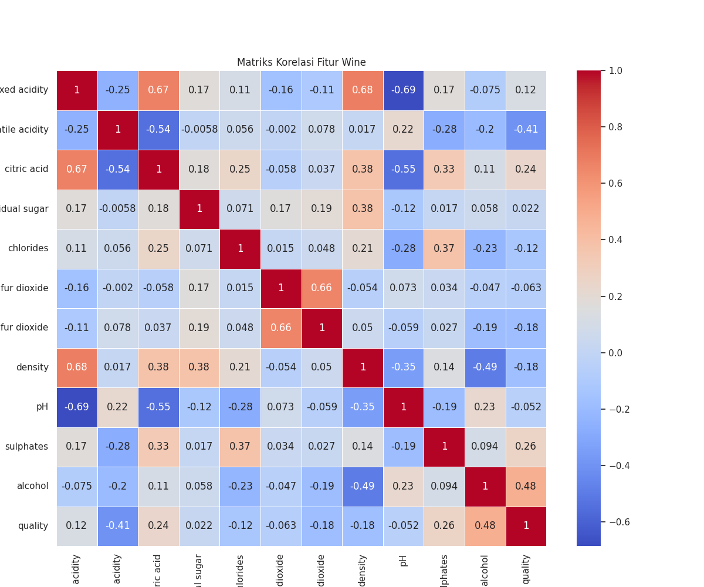
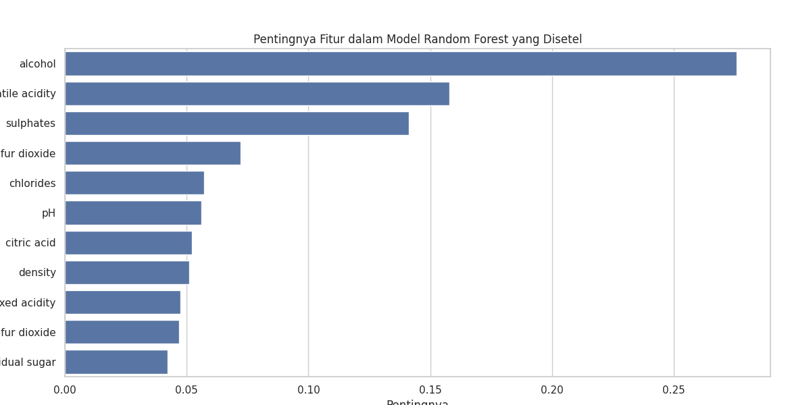

# Laporan Proyek Machine Learning - Ilham Maulana

## Domain Proyek

Wine merupakan minuman beralkohol yang telah menjadi bagian dari kebudayaan manusia selama ribuan tahun. Industri wine global diperkirakan bernilai lebih dari $340 miliar pada tahun 2021 dan diproyeksikan mencapai $456 miliar pada tahun 2028 [1]. Dengan nilai ekonomi yang signifikan ini, kualitas wine menjadi faktor penting yang mempengaruhi harga, penerimaan konsumen, dan keberhasilan produsen di pasar yang kompetitif.

Proses produksi wine yang berkualitas tinggi memerlukan pemahaman mendalam tentang faktor-faktor yang mempengaruhi karakteristik sensorik (aroma, rasa, penampilan) produk akhir. Produsen wine tradisional mengandalkan pengalaman bertahun-tahun dan penilaian subjektif untuk mengevaluasi kualitas, namun pendekatan ini memiliki keterbatasan dalam konsistensi, efisiensi, dan skalabilitas.

Dengan kemajuan teknologi dan analitik data, produsen wine kini dapat memanfaatkan machine learning untuk memprediksi kualitas wine berdasarkan atribut fisikokimia yang dapat diukur secara objektif. Pendekatan ini memungkinkan produsen untuk:

1. Mengoptimalkan proses produksi dengan mengidentifikasi parameter yang paling berpengaruh terhadap kualitas.
2. Mengurangi waktu dan biaya pengembangan produk baru.
3. Memastikan konsistensi kualitas produk lintas batch produksi.
4. Mengimplementasikan sistem kontrol kualitas yang lebih objektif dan terukur.

Dalam proyek ini, saya menggunakan dataset "Wine Quality" yang berisi atribut fisikokimia dari wine beserta penilaian kualitasnya. Tujuan utama adalah membangun model machine learning yang dapat memprediksi apakah suatu wine memiliki kualitas baik atau tidak berdasarkan karakteristik fisikokimianya. Model ini nantinya dapat digunakan oleh produsen wine untuk memprediksi kualitas produk sebelum dilakukan penilaian sensorik yang lebih mahal dan memakan waktu, sehingga dapat mempercepat proses pengembangan produk dan kontrol kualitas.

## Business Understanding

### Problem Statements

Berdasarkan latar belakang di atas, permasalahan yang ingin diselesaikan melalui proyek ini adalah:

1. Atribut fisikokimia manakah yang memiliki pengaruh paling signifikan terhadap kualitas wine?
2. Bagaimana membangun model prediktif yang akurat untuk mengklasifikasikan kualitas wine berdasarkan atribut fisikokimianya?
3. Bagaimana perbandingan performa berbagai algoritma machine learning dalam memprediksi kualitas wine?

### Goals

Tujuan dari proyek ini adalah:

1. Mengidentifikasi atribut fisikokimia yang paling berpengaruh terhadap kualitas wine.
2. Mengembangkan model prediktif yang dapat mengklasifikasikan wine ke dalam kategori kualitas baik atau kurang baik dengan akurasi minimal 75%.
3. Membandingkan dan mengevaluasi performa beberapa algoritma machine learning untuk menemukan model terbaik dalam memprediksi kualitas wine.

### Solution Statements

Untuk mencapai tujuan tersebut, berikut adalah solusi yang diusulkan:

1. Melakukan analisis eksplorasi data (EDA) untuk memahami distribusi dan hubungan antar variabel, serta mengidentifikasi atribut yang paling berkorelasi dengan kualitas wine.
2. Melakukan preprocessing data, termasuk penanganan missing values (jika ada), transformasi fitur, dan standardisasi/normalisasi.
3. Membangun dan membandingkan beberapa model klasifikasi, antara lain:
   - Random Forest
   - K-Nearest Neighbors (KNN)
   - Gradient Boosting
4. Melakukan hyperparameter tuning untuk mengoptimalkan performa model terbaik.
5. Mengevaluasi dan membandingkan performa model menggunakan metrik yang relevan seperti accuracy, precision, recall, dan F1-score.

## Data Understanding

Dataset yang digunakan dalam proyek ini adalah "Wine Quality Dataset" yang berisi informasi tentang atribut fisikokimia wine merah berserta penilaian kualitasnya. Dataset ini tersedia secara publik dan sering digunakan dalam studi machine learning.

### Variabel-variabel pada Wine Quality dataset adalah sebagai berikut:

1. **fixed acidity**: Keasaman tetap dalam wine (g/dm³)
2. **volatile acidity**: Keasaman yang mudah menguap dalam wine (g/dm³)
3. **citric acid**: Kadar asam sitrat dalam wine (g/dm³)
4. **residual sugar**: Kandungan gula sisa dalam wine (g/dm³)
5. **chlorides**: Kandungan garam dalam wine (g/dm³)
6. **free sulfur dioxide**: Kadar sulfur dioksida bebas dalam wine (mg/dm³)
7. **total sulfur dioxide**: Total kadar sulfur dioksida dalam wine (mg/dm³)
8. **density**: Kepadatan wine (g/cm³)
9. **pH**: Tingkat keasaman wine (skala 0-14)
10. **sulphates**: Kandungan sulfat dalam wine (g/dm³)
11. **alcohol**: Persentase alkohol dalam wine (% by volume)
12. **quality**: Skor kualitas wine (skala 0-10)

### Exploratory Data Analysis (EDA)

#### Distribusi Kualitas Wine

Berikut adalah distribusi skor kualitas wine dalam dataset:

Dari gambar di atas, dapat dilihat bahwa sebagian besar wine memiliki skor kualitas 5 dan 6. Skor kualitas 3 dan 8 sangat jarang ditemui. Hal ini menunjukkan ketidakseimbangan dalam distribusi kelas target.

#### Korelasi antar Variabel

Untuk memahami hubungan antar variabel, berikut adalah matriks korelasi dari atribut-atribut tersebut:

Dari matriks korelasi di atas, dapat dilihat bahwa:

- **Alkohol** memiliki korelasi positif yang cukup kuat dengan kualitas wine (0.48)
- **Volatile acidity** memiliki korelasi negatif dengan kualitas wine (-0.41)
- **Sulphates** memiliki korelasi positif dengan kualitas wine (0.26)

#### Hubungan antara Alkohol dan Kualitas Wine

Dari visualisasi di atas, terlihat bahwa wine dengan kualitas lebih tinggi cenderung memiliki kadar alkohol yang lebih tinggi pula. Ini konsisten dengan hasil analisis korelasi sebelumnya.

#### Hubungan antara Volatile Acidity dan Kualitas Wine

Visualisasi ini menunjukkan bahwa wine dengan kualitas lebih tinggi cenderung memiliki kadar volatile acidity yang lebih rendah. Ini juga sesuai dengan korelasi negatif yang ditemukan pada matriks korelasi.

#### Analisis Multivariate

Pairplot di atas menunjukkan hubungan antara beberapa variabel penting dengan kualitas wine. Dari visualisasi ini, kita dapat melihat pola-pola yang menegaskan temuan sebelumnya tentang hubungan antara alkohol, volatile acidity, dan sulphates dengan kualitas wine.

### Pengubahan Target Variabel

Untuk menyederhanakan masalah klasifikasi, skor kualitas wine (0-10) diubah menjadi klasifikasi biner:

- 0: Wine dengan kualitas kurang baik (skor < 6)
- 1: Wine dengan kualitas baik (skor ≥ 6)

Berikut adalah distribusi kategori setelah transformasi:

## Data Preparation

Berikut adalah langkah-langkah persiapan data yang dilakukan:

1. **Penghapusan fitur yang tidak relevan**

   - Kolom ID dihapus karena tidak memberikan informasi yang berguna untuk prediksi.

2. **Penanganan Missing Values**

   - Setelah pengecekan, tidak ditemukan missing values dalam dataset.

3. **Feature Scaling**

   - Standardisasi dilakukan pada seluruh fitur menggunakan StandardScaler. Hal ini penting karena algoritma seperti KNN sangat sensitif terhadap skala fitur.
   - Standardisasi memastikan semua fitur memiliki mean 0 dan standar deviasi 1, sehingga fitur dengan skala berbeda dapat dibandingkan secara adil.

4. **Pembuatan Variabel Target Biner**

   - Skor kualitas ditransformasi menjadi variabel biner:
     - 0: Kualitas kurang baik (skor < 6)
     - 1: Kualitas baik (skor ≥ 6)
   - Transformasi ini dilakukan untuk menyederhanakan masalah menjadi klasifikasi biner.

5. **Train-Test Split**
   - Dataset dibagi menjadi data training (80%) dan data testing (20%) dengan stratifikasi pada variabel target untuk memastikan distribusi target yang seimbang pada kedua set data.
   - Random state di-set ke 42 untuk memastikan reproduksibilitas hasil.

Langkah-langkah persiapan data ini sangat penting untuk memastikan data siap diproses oleh algoritma machine learning dan menghasilkan model dengan performa yang optimal.

## Modeling

Dalam proyek ini, tiga algoritma machine learning digunakan untuk memprediksi kualitas wine:

1. **Random Forest**

   - Random Forest adalah algoritma ensemble yang terdiri dari beberapa decision tree.
   - Kelebihan: Tahan terhadap overfitting, mampu menangani data non-linear, dan dapat menangani banyak fitur.
   - Kekurangan: Membutuhkan memori yang lebih besar dan waktu komputasi yang lebih lama.
   - Parameter yang digunakan:
     - n_estimators: 100 (default)
     - random_state: 42

2. **K-Nearest Neighbors (KNN)**

   - KNN adalah algoritma sederhana berbasis jarak yang mengklasifikasikan sampel berdasarkan mayoritas kelas k tetangga terdekatnya.
   - Kelebihan: Sederhana, mudah diimplementasikan, dan tidak memerlukan asumsi tentang data.
   - Kekurangan: Sensitif terhadap skala fitur dan dapat lambat pada dataset besar.
   - Parameter yang digunakan:
     - n_neighbors: 5 (default)
     - metric: minkowski (default)

3. **Gradient Boosting**
   - Gradient Boosting adalah algoritma ensemble yang membangun model secara sekuensial, dengan setiap model berusaha memperbaiki kesalahan model sebelumnya.
   - Kelebihan: Biasanya memiliki performa yang sangat baik, tahan terhadap outlier, dan dapat menangani data non-linear.
   - Kekurangan: Sensitif terhadap hyperparameter dan rentan terhadap overfitting.
   - Parameter yang digunakan:
     - n_estimators: 100 (default)
     - learning_rate: 0.1 (default)
     - random_state: 42

Setelah evaluasi awal, Random Forest menunjukkan performa terbaik, sehingga dilakukan hyperparameter tuning pada model ini menggunakan Grid Search CV:

4. **Random Forest Optimal**
   - Grid Search dilakukan dengan mencoba berbagai kombinasi parameter:
     - n_estimators: [100, 200, 300]
     - max_features: ['sqrt']
     - min_samples_split: [2, 5, 10]
   - Parameter terbaik yang ditemukan:
     - n_estimators: 300 (lebih banyak trees untuk performa lebih baik)
     - min_samples_split: 10
     - max_features: 'sqrt'
     - random_state: 42

Hasil cross-validation menunjukkan perbandingan performa ketiga model dasar:

Dari visualisasi di atas, terlihat bahwa Random Forest secara konsisten menunjukkan performa terbaik dibandingkan model lainnya.

## Evaluation

Untuk mengevaluasi performa model, beberapa metrik evaluasi digunakan:

1. **Accuracy**: Proporsi prediksi yang benar dari total prediksi.
2. **Precision**: Proporsi prediksi positif yang benar dari total prediksi positif.
3. **Recall**: Proporsi dari kasus positif aktual yang teridentifikasi dengan benar.
4. **F1-Score**: Rata-rata harmonik dari precision dan recall.

Berikut adalah perbandingan metrik evaluasi untuk keempat model:

Dari perbandingan metrik di atas, Random Forest Optimal menunjukkan performa terbaik dengan:

- Accuracy: 0.8035
- Precision: 0.8062
- Recall: 0.8387
- F1-Score: 0.8221

Detail performa Random Forest Optimal dapat dilihat pada confusion matrix berikut:

Confusion matrix menunjukkan bahwa model Random Forest Optimal berhasil memprediksi dengan benar:

- 80 sampel kelas "Kurang Baik" (True Negative)
- 104 sampel kelas "Baik" (True Positive)

Sementara itu, model melakukan kesalahan prediksi pada:

- 20 sampel yang sebenarnya "Baik" tetapi diprediksi "Kurang Baik" (False Negative)
- 25 sampel yang sebenarnya "Kurang Baik" tetapi diprediksi "Baik" (False Positive)

Untuk memahami fitur mana yang paling berpengaruh dalam prediksi kualitas wine, berikut adalah analisis feature importance dari model Random Forest Optimal:

Dari analisis feature importance, dapat dilihat bahwa:

1. **Alcohol** adalah fitur yang paling berpengaruh dalam menentukan kualitas wine.
2. **Sulphates** berada di peringkat kedua.
3. **Volatile acidity** dan **total sulfur dioxide** juga memiliki pengaruh yang signifikan.

Hasil ini konsisten dengan temuan pada fase Data Understanding, di mana alcohol dan volatile acidity memiliki korelasi tertinggi dengan kualitas wine.

## Conclusion

Berdasarkan hasil analisis dan pemodelan, dapat disimpulkan bahwa:

1. Atribut fisikokimia yang paling berpengaruh terhadap kualitas wine adalah:

   - Kadar alkohol (alcohol)
   - Keasaman yang mudah menguap (volatile acidity)
   - Kandungan sulfat (sulphates)
   - Total sulfur dioksida (total sulfur dioxide)

2. Model Random Forest Optimal berhasil memprediksi kualitas wine dengan akurasi 80.35%, melebihi target minimal 75% yang ditetapkan. Ini menunjukkan bahwa model dapat digunakan dengan cukup handal untuk memprediksi kualitas wine berdasarkan atribut fisikokimianya.

3. Di antara model yang dibandingkan, Random Forest menunjukkan performa terbaik, diikuti oleh Gradient Boosting dan KNN. Hasil ini menunjukkan bahwa algoritma ensemble seperti Random Forest sangat efektif dalam menangani masalah klasifikasi kompleks seperti prediksi kualitas wine.

Hasil proyek ini dapat dimanfaatkan oleh produsen wine untuk:

- Mengoptimalkan proses produksi dengan fokus pada parameter yang paling berpengaruh terhadap kualitas.
- Mengimplementasikan sistem kontrol kualitas otomatis berbasis model machine learning.
- Mengurangi waktu dan biaya pengembangan produk baru dengan melakukan prediksi kualitas di awal proses.

## Referensi

[1] Mordor Intelligence. (2022). Wine Market - Growth, Trends, COVID-19 Impact, and Forecasts (2022-2028).

[2] P. Cortez, A. Cerdeira, F. Almeida, T. Matos and J. Reis. Modeling wine preferences by data mining from physicochemical properties. In Decision Support Systems, Elsevier, 47(4):547-553, 2009.

[3] Scikit-learn: Machine Learning in Python, Pedregosa et al., JMLR 12, pp. 2825-2830, 2011.
